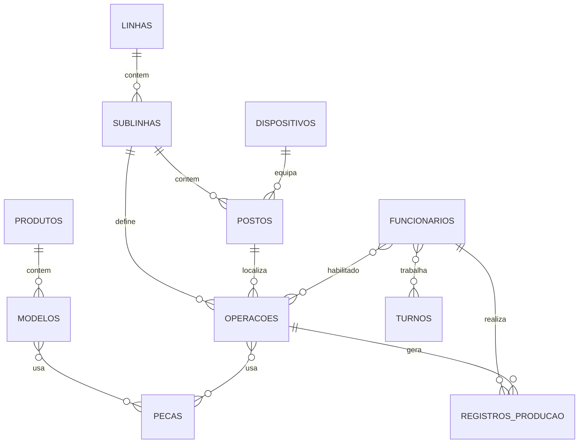

# Modelo de domínio

Visão das entidades de negócio e como se relacionam. O schema físico está em `Backend/database/database.sql`.

## Hierarquia da fábrica

```
Linha
 └── Sublinha
      └── Posto ──► Dispositivo Raspberry (opcional)
```

- **Linha**: agrupamento superior (ex.: linha de montagem).
- **Sublinha**: subdivisão da linha; postos e operações referenciam sublinha.
- **Posto**: ponto físico de trabalho; pode estar vinculado a um totem (dispositivo).
- **Dispositivo Raspberry**: identificado por `serial_number` (lido do hardware no Pi).

## Produção e cadastros

```
Produto
 └── Modelo ──► Peças (N:N via modelo_pecas)

Operação ──► Sublinha, Posto, Produto, Modelo, Dispositivo
          └── Peças (N:N via operacao_pecas)

Funcionário ──► Turnos (N:N)
             └── Operações permitidas (N:N via funcionario_operacoes)

Registro de produção ──► Funcionário + Operação
                      (entrada/saída, quantidade, comentário)
```

### Operação

Centraliza **o que** é feito **onde** e **com qual produto/modelo**:

| Campo | Significado |
|-------|-------------|
| `nome` | Nome exibido na IHM e relatórios |
| `sublinha_id` | Localização lógica |
| `posto_id` | Posto físico |
| `produto_id` / `modelo_id` | Referência de produto |
| `dispositivo_id` | Totem associado (opcional) |
| `data_inicio` / `data_fim`, `horario_inicio` / `horario_fim` | Janela de validade (quando usada) |

### Registro de produção

Representa um ciclo de trabalho do operador em uma operação:

| Campo | Significado |
|-------|-------------|
| `funcionario_id` | Quem executou |
| `operacao_id` | Em qual operação |
| `data_inicio`, `horario_inicio` | Início (IHM: entrada) |
| `data_fim`, `horario_fim` | Fim (IHM: saída); `NULL` = em aberto |
| `quantidade` | Informada na saída |
| `comentario` | Observação (saída ou dashboard) |

**Em aberto**: registro sem `horario_fim` (ou sem `data_fim`, conforme consulta).

### Funcionário

| Campo | Significado |
|-------|-------------|
| `tag` | RFID principal |
| `matricula` | Identificador único na produção |
| `tag_temporaria` | Tag alternativa com `expiracao_tag_temporaria` |
| `ativo` | Se `false`, não pode iniciar produção |
| `data_remocao` | Soft delete (quando aplicado no DAO) |

### Usuário (sistema)

Conta para login no **painel admin** (`usuarios`), distinta de funcionário:

| Role | Uso típico |
|------|------------|
| `admin` | Gestão operacional |
| `master` | Admin + usuários |
| `operador` | Conta de sistema (ex.: integrações); não é o operador da IHM |

## Diagrama ER (simplificado)



## Conceitos na interface

| Termo na UI/API | Entidade |
|-----------------|----------|
| Operador (IHM) | `funcionario.nome` |
| Totem | `dispositivo.serial_number` |
| Código da operação (IHM) | Frequentemente `operacao.id` como string |
| Código da peça | `peca.codigo` |

## Timezone

O banco é inicializado com `SET TIME ZONE 'America/Manaus'` em `database.sql`. Considere isso ao interpretar timestamps e ao agendar turnos.

## Onde alterar o domínio

| Mudança | Arquivos típicos |
|---------|------------------|
| Nova coluna/tabela | `database.sql`, `Model/`, `DAO/`, migration no `app.py` startup se necessário |
| Nova regra | `services/` |
| Novo endpoint | `controller/`, `Web/src/services/` |

Veja também [REGRAS_NEGOCIO.md](./REGRAS_NEGOCIO.md) e [BANCO_DADOS.md](./BANCO_DADOS.md).
