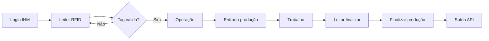

# Interface HMI (IHM)

Interface de **chão de fábrica** para operadores: leitura de tag RFID, início e fim de apontamento de produção. Otimizada para touch (teclado virtual global).

## Rotas React

| Rota | Componente | Função |
|------|------------|--------|
| `/ihm/login` | `LoginIHM.tsx` | Tela inicial IHM |
| `/ihm/leitor` | `Leitor.tsx` | Leitura RFID |
| `/ihm/operacao` | `Operacao.tsx` | Escolha/confirmação de operação e entrada |
| `/ihm/leitor-finalizar` | `LeitorFinalizar.tsx` | RFID para finalizar |
| `/ihm/finalizar-producao` | `FinalizarProducao.tsx` | Quantidade e saída |

Redirecionamentos: `/IHM` e `/ihm` → `/ihm/login` (`App.tsx`).

Rotas IHM **não** usam `ProtectedRoute` de usuário admin.

## Fluxo do operador



### 1. Leitura RFID (`/ihm/leitor`)

- Campo focado automaticamente (leitor USB emula teclado).
- `ihmAPI.validarRfid(codigo)` → `GET /api/ihm/rfid/{codigo}`.
- Sucesso: salva `ihm_sessao` e navega para `/ihm/operacao` com `operador` = **nome** do funcionário.

```json
// Resposta sucesso
{
  "status": "success",
  "funcionario": { "id", "nome", "matricula", "tag" }
}
```

Erro de tag: `status: "error"` (sem exceção HTTP).

### 2. Contexto de operação

`ihmAPI.buscarContextoOperacao(operador)` → `GET /api/ihm/contexto-operacao/{operador}`

- `operador` = **nome** do funcionário (não matrícula).
- Retorna lista de operações com produto, modelo, posto, peças e códigos.

### 3. Entrada de produção

`producaoAPI.registrarEntrada` → `POST /api/ihm/producao/entrada`

Payload mínimo:

```json
{
  "funcionario_matricula": "12345",
  "operacao": "7",
  "posto": "Posto A"
}
```

Resposta inclui `registro_id`, `hora_inicio`, `data`, `produto`.

Dispara atualização do **dashboard** via WebSocket.

### 4. Registro em aberto

Antes de duplicar entrada, a UI pode consultar:

`GET /api/ihm/producao/registro-aberto?posto=X&funcionario_matricula=Y`

### 5. Saída de produção

`producaoAPI.registrarSaida` → `POST /api/ihm/producao/saida`

```json
{
  "registro_id": 42,
  "quantidade": 15,
  "comentario": "opcional"
}
```

Alternativa: informar `posto` + `funcionario_matricula` sem `registro_id` (backend resolve o aberto).

## Sessão e recuperação após reboot

**Chave:** `localStorage.ihm_sessao`

```json
{ "operador": "João Silva" }
```

Ao abrir `/ihm/leitor`, se existir sessão com `operador`, redireciona para `/ihm/operacao` (recuperação após reinício do Raspberry).

Limpar sessão ao encerrar fluxo ou em logout explícito da IHM (conforme implementado nas páginas).

## Teclado virtual

- Provider: `VirtualKeyboardContext` em `main.tsx`.
- Componente global: `<VirtualKeyboard />`.
- Inputs: `InputWithKeyboard` onde necessário em telas touch.

## API helpers (frontend)

Definidos em `Web/src/api/api.ts`:

| Objeto | Funções |
|--------|---------|
| `ihmAPI` | `validarRfid`, `buscarContextoOperacao` |
| `producaoAPI` | `buscarRegistroAberto`, `registrarEntrada`, `registrarSaida`, `cancelarRegistro` |

## Dispositivo e posto

- No startup do backend, o Pi tenta registrar seu serial em `dispositivos_raspberry`.
- Postos podem referenciar `dispositivo_id`.
- A operação escolhida na entrada pode vir do ID, do nome do posto ou do fallback (primeira operação).

## Diferença: funcionário vs usuário operador

| | Funcionário (IHM) | Usuário `role=operador` |
|--|-------------------|-------------------------|
| Autenticação | Tag RFID | Login/senha no sistema |
| Uso | Apontamento na linha | Conta no banco `usuarios` |
| API | `/ihm/*` | `/usuarios/login` |

Não confundir o operador da linha com a role `operador` do cadastro de usuários.

## Testes manuais sugeridos

1. Cadastrar funcionário com tag e matrícula ativos.
2. Cadastrar operação vinculada a posto/produto.
3. Na IHM, passar tag → ver operação → registrar entrada.
4. Abrir dashboard admin e confirmar posto `em_operacao`.
5. Finalizar com quantidade → posto `livre` e registro com `horario_fim`.

## Telas admin relacionadas

- **Dispositivos Raspberry:** `/dispositivos-raspberry` (roles `admin`, `master`)
- **Postos / Operações / Funcionários:** cadastros necessários antes da IHM funcionar

Veja [REGRAS_NEGOCIO.md](./REGRAS_NEGOCIO.md) e [API.md](./API.md) para contratos HTTP completos.
